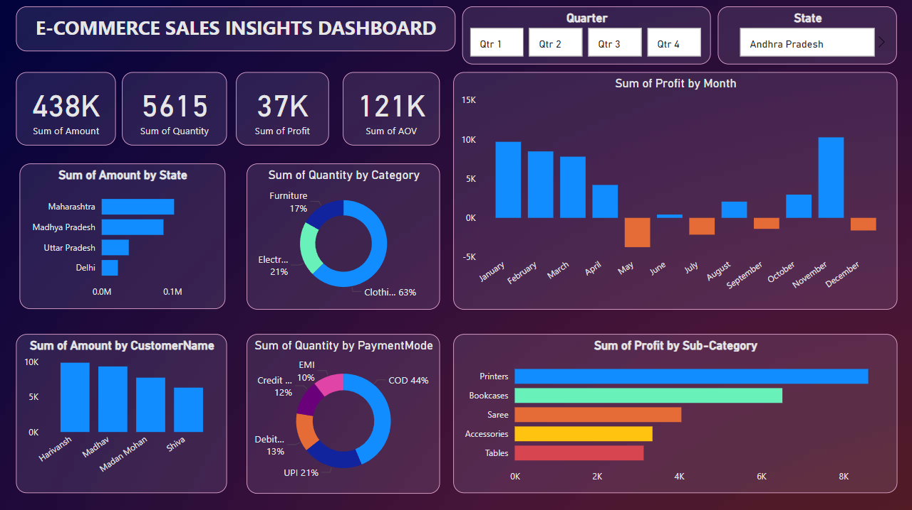

# E-commerce Sales Insights using Power BI

## Project Overview
The "E-commerce Sales Insights using Power BI" project aims to create a comprehensive and interactive dashboard to analyze sales performance for an e-commerce business. The dashboard provides insights into various metrics such as total sales, sales trends, customer demographics, product performance, and more.

## Tech Stack
- **Power BI Desktop**: For creating and designing the dashboard.
- **Power BI Service**: For sharing and collaboration.
- **Excel**: For importing data from spreadsheets.
- **CSV/JSON/XML**: For importing data from various formats.
- **Power Query**: For data transformation and preparation.
- **DAX (Data Analysis Expressions)**: For advanced calculations and data modeling.

## Features
- Interactive dashboard with slicers and filters.
- Sales performance metrics such as total sales, average order value, and sales trends.
- Customer insights including demographics and purchase behavior.
- Product performance analysis.
- Geographic analysis of sales.

## Data Sources
- **SQL Server**: For historical sales data.
- **Azure Data Lake**: For large datasets and unstructured data.
- **Excel/CSV**: For importing additional data.
- **APIs**: For real-time data integration.

## Installation
1. **Power BI Desktop**: Download and install from [Power BI Desktop](https://powerbi.microsoft.com/desktop/).
2. **Data Sources**: Prepare your data in Excel, CSV, or other formats.

## Usage
1. **Open Power BI Desktop**: Launch Power BI Desktop on your computer.
2. **Load Data**: Connect to your data sources (SQL Server, Excel, CSV, Azure Data Lake) and load the data into Power BI.
3. **Transform Data**: Use Power Query to clean and transform the data as needed.
4. **Create Visuals**: Build your dashboard by adding various visualizations (charts, tables, maps).
5. **Add Interactivity**: Incorporate slicers, filters, and drill-throughs for enhanced interactivity.
6. **Publish Dashboard**: Publish your dashboard to Power BI Service for sharing and collaboration.

## Contributing
Contributions are welcome! If you have suggestions or improvements, please create a pull request or open an issue.

